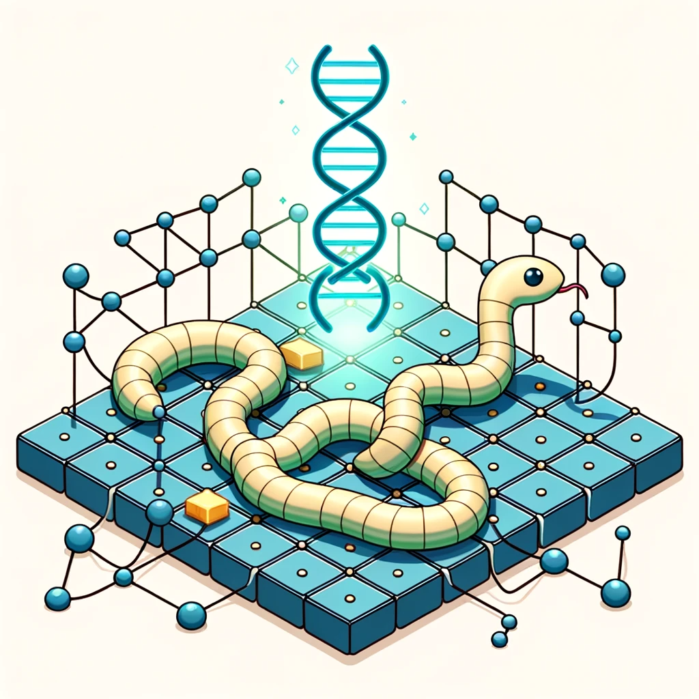

# Genetic snakes!

<p align="center">
  
</p>

## Installation and setup
To install the necessary dependencies:
```bash
pip install -r requirements.txt
```

Then, to compile and set up the C++ module, run
```bash
pip install .
```

## Usage
### Train a new neural network
Training a new neural network happens through running the genetic algorithm to produce increasingly competent generations of networks until, finally, a network beats the game. A checkpoint of this network will then be saved and can be used to play games for your entertainment later!

To start the genetic algorithm, simply run the run.py file:
```bash
python run.py
```

The following optional arguments can also be specified:

* `-size` (int): The grid size of the snake game environment. (default=10)
* `-parents` (int): The number of surviving individuals that will be selected for reproduction each generation. (default=750)
* `-children` (int): The number of children to produce through reproduction each generation. (default=750)
* `-ind` (str): The path to a directory storing a neural network checkpoint. When provided, the individual is loaded and plays one game of snake displayed using the GUI. (default=None)
* `-threads` (int): Number of threads to use to parallelize the game-play portion of the genetic algorithm. Parallel processing is only enabled when running with the --nogui flag. (default=1)
* `-name` (str): Name of the output directory storing the neural network parameters of the first snake to beat the game. (default=None)
* `-name` (str): Name of the output directory storing the neural network parameters of the first snake to beat the game. (default=None)
* `--usecpp`: Use the C++ backend module for greater performance.
* `--nogui`: Run the genetic algorithm without a GUI. This results in significantly faster training and enables multithreading.

### Play a trained network
After having trained and stored a neural network checkpoint, you can watch it play snake by providing the name of the directory storing the network's parameters to the run.py file:
```bash
python run.py -ind <directory name>
```
The directory provided should contain the .npy files making up the parameter matrices of the neural network.
If you want to run a trained network on a snake game of a different size than what it was trained on, just use -size to resize the environment and see how it does for yourself!